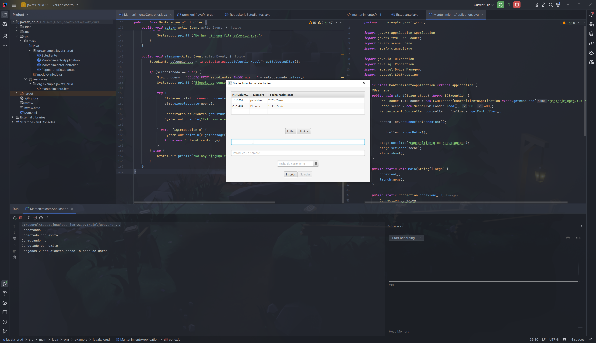
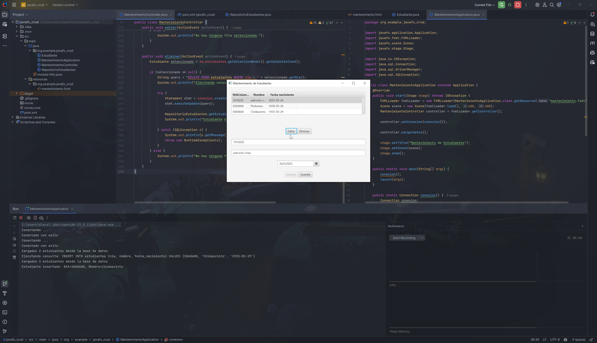
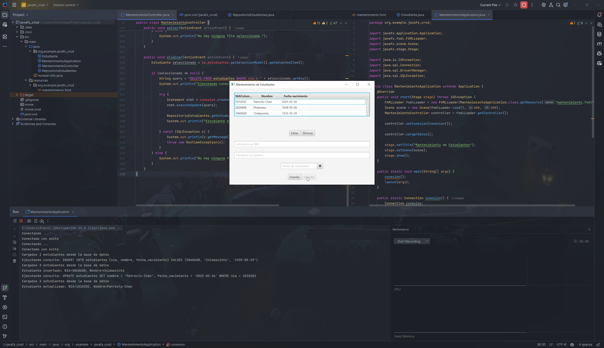
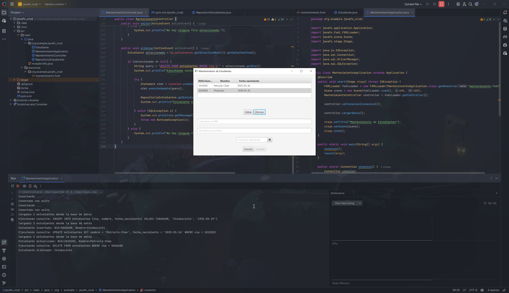

# Java CRUD

Consultas a BBDD. *Create, Read, Update and Delete* en Java. 

## Pruebas

Carga de la base de datos.

 

---

Insertar datos a la tabla.

---

Los datos de la tabla se actualizan en tiempo real, cargando los datos de la tabla.

---

Actualización de los datos de la tabla. El nombre ahora empieza por mayusculas.

---

Finalmente, comprobamos que también se puede eliminar una fila de la tabla. 

*Adios Chidasvinto.*
